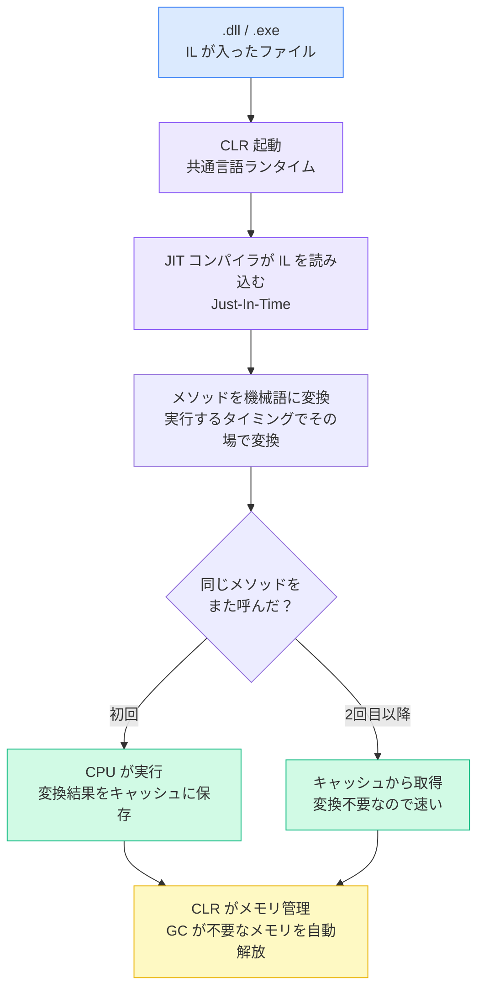

# 1. C#とは？
C#とは、あのMicrosoftが2000年7月にリリースしたプログラミング言語です。

公式ドキュメントによると**シンプルでモダンで汎用のオブジェクト指向プログラミング言語**を意図しており、業務システムやWebアプリケーション、ゲームなど幅広い開発に利用されています。

## 特徴
そんなC#ですが、以下のような特徴があります。

- 静的型付けのため型安全性が高い
- 同じMicrosoft製品であるOfficeやWindowsの操作のライブラリが豊富
- Windows・Mac・Linux どこでも動く
- Microsoftが長期的にサポートしており、情報・ドキュメントが充実

## 何ができるの？
前述の通り、C#は「何か一つに特化した言語」ではなく、さまざまな用途に対応できる汎用言語です☝️

| 用途                          | 対象のフレームワーク | 具体例                                         |
| ----------------------------- | -------------------- | ---------------------------------------------- |
| Web サイト・Web API           | ASP.NET Core         | 社内システムの画面、スマホアプリのバックエンド |
| Windows のデスクトップアプリ  | WPF / WinForms       | ツール系アプリ、管理画面                       |
| ゲーム                        | Unity                | スマホゲーム、PC ゲーム                        |
| クラウド上で動く処理          | Azure Functions      | 定期バッチ、イベント処理                       |
| スマホアプリ（iOS / Android） | .NET MAUI            | クロスプラットフォームのモバイルアプリ         |
| コマンドラインツール・バッチ  | .NET Console App     | ファイル処理、データ変換スクリプト             |


# 2. .NETとの関連性
フレームワークの名前でも登場している ".NET" ですが、C#を語る上では外せない存在です。他の言語も同様だと思いますが、C#はコードファイル単体ではプログラムとして動かすことはできません🙅‍♂️

そこで、C#を実行するための仕組みや、よく使う機能のライブラリをまとめた**.NET**というプラットフォームが用意されています。それが ".NET"です！

:::note info
**「C# は言語、.NET はその言語を動かす土台」** と理解しておくとよいでしょう。
:::

## .NETの歴史
.NET にはいくつかの世代があります。現場のプロジェクトによってどれを使っているか異なるため、見分けられるようにしておきましょう。

| 名称                       | 対応 OS               | 今どういう状況か                                                                                 |
| -------------------------- | --------------------- | ------------------------------------------------------------------------------------------------ |
| .NET Framework（1.0〜4.8） | Windows のみ          | 古い世代。新しく作るプロジェクトでは使わないが、昔のシステムの保守では今でも登場することがある。 |
| .NET Core（1.0〜3.1）      | Windows / Mac / Linux | クロスプラットフォーム対応として登場した世代。現在はサポートが終了している。                     |
| .NET 5 以降（現在の主流）  | Windows / Mac / Linux | 上の 2 つを統合した最新世代。「.NET 6」「.NET 8」などと呼ばれる。新規開発はこちらを使う。        |

## .NETの構成要素
| パーツ名 | 役割                 | 何をしているか                                                                                                                   |
| -------- | -------------------- | -------------------------------------------------------------------------------------------------------------------------------- |
| Roslyn   | コンパイラ           | C# コードを、コンピュータが直接理解できる形式（中間言語）に変換する。                                                            |
| CLR      | 共通言語ランタイム   | 変換されたコードを実際にコンピュータ上で動かす仕組み。使い終わったメモリの後片付け（ガベージコレクション）も自動でやってくれる。 |
| BCL      | 基本クラスライブラリ | 「文字列を切り取る」「ファイルを読む」「今日の日付を取得する」など、よく使う機能を集めたライブラリ。                             |
| NuGet    | 追加パッケージ       | BCLにない機能（PDF 作成、メール送信など）を、世界中の開発者が公開しているパッケージとして追加できる。                            |
| MSBuild  | ビルド作業の自動化   | 「コンパイルして → テストして → 実行ファイルを作る」という一連の作業を自動でやってくれる。                                       |

# 3. コードが動くまでの流れ
.NET を使ってプログラムが実行されるわけですが、C#のコードが実際に動くまでには **「ビルド」** と **「実行」** の2段階があります。

|            | ビルド             | 実行                     |
| ---------- | ------------------ | ------------------------ |
| タイミング | 開発時・デプロイ前 | プログラム起動時・実行中 |
| 主役       | Roslyn             | CLR / JIT                |
| 出力物     | .dll / .exe        | プログラムの実行結果     |

## ビルドの流れ


1. 開発者が書いた `.cs` ファイルを **Roslyn** が読み込む
2. コードの文法チェックを行い、エラーがあればここで止まる
3. 問題なければ **IL（中間言語）** に変換する
4. プロジェクトの種類に応じて **.dll または .exe** に出力する

:::note warn
ILが.dllまたは.exeに格納されますが、この時点ではまだコンピュータが直接認識可能なコードではありません。ILはどのOS/CPUでも共通の中間言語です。
:::

---

### .dllと.exeって何が違うの？
C# のプロジェクトをビルドすると **.dll** または **.exe** が生成されますが、違いは単体で実行可能か否かです。

|                          | .dll                   | .exe                             |
| ------------------------ | ---------------------- | -------------------------------- |
| 単体で実行できる？       | ❌ できない             | ✅ できる                         |
| 用途                     | 機能の部品・ライブラリ | アプリケーション本体             |
| 作られるプロジェクト種別 | クラスライブラリ       | コンソールアプリ・WPF アプリなど |

実際の現場では、大きなシステムを機能ごとに .dll に分割して、.exe からそれらを呼び出すという構成がよく使われます。

例えば、使い分けはこんな感じ。
```
MySystem.exe          ← アプリの起動口（エントリーポイント）
  ├── MySystem.Core.dll       ← 業務ロジック（計算・バリデーションなど）
  ├── MySystem.Database.dll   ← DB アクセス処理
  ├── MySystem.Excel.dll      ← Excel 出力処理
  └── MySystem.Common.dll     ← 共通ユーティリティ（日付変換・ログなど）
```

## 実行の流れ


1. `.exe` を起動すると **CLR（共通言語ランタイム）** が立ち上がる
2. **JIT（Just-In-Time）コンパイラ** が IL を読み込む
3. 実行するメソッドをその場で機械語に変換して CPU に渡す
4. 同じメソッドは 2 回目以降キャッシュされるので、繰り返し呼ばれるほど速くなる
5. 実行中、CLR が **メモリ管理（GC）** も並行して行う

# 4. 開発環境の構築
仕組みは理解できたと思うので、実際に開発を進めていくためには準備について触れていきます。

## .NET SDKのインストール
**.NET SDK**とは、C#で開発するために必要な道具一式をまとめたパッケージです。SDKは"Software Development Kit"の略ですね🛠️

### SDKに含まれているもの
- .NET Runtime(CLR)
- Roslyn(コンパイラ)
- dotnet CLI(プロジェクト作成、ビルド、実行などをコマンドから実行する)

## 開発ツール(IDE)の選択
コードを実装するためにはもちろんエディタが必要です。
まあ好きなエディタを選べば良いのですが、C#開発で選択肢に入ってくるのは以下の3つでしょうか。

| ツール名                  | 特徴・向いている人i                                                                                               | 費用               |
| ------------------------- | ----------------------------------------------------------------------------------------------------------------- | ------------------ |
| **Visual Studio（推奨）** | C# 専用に最適化されたフル機能の IDE。コード補完・デバッグ・エラー表示が強力で初心者にも使いやすい。Windows 専用。 | Community 版は無料 |
| Visual Studio Code        | 軽量なエディタ。「C# Dev Kit」という拡張機能を追加すれば C# 開発ができる。Mac・Linux でも使える。                 | 無料               |
| JetBrains Rider           | Windows・Mac・Linux に対応した高機能 IDE。リファクタリング機能が特に強力。                                        | 有償（学生は無料） |

:::note info
**Visual Studioをインストールすれば.NET SDKはついてきます！**
インストーラーでワークロード（「.NET デスクトップ開発」など）を選ぶと、対応する .NET SDK がセットで入ります。別途 SDK をインストールする必要はありません。
:::

## プロジェクトの生成
C#を動かす環境が整ったら、実際にプロジェクトを生成します。
Visual Studioを利用している場合はGUIから作成可能ですが、もちろんdotnet CLIのコマンドからも作成できます。

```bash
dotnet new console -n MyApp  # 「MyApp」という名前の新しいプロジェクトを作る
cd MyApp                     # 作ったフォルダに移動する
dotnet run                   # プログラムをビルドして実行する
```

プロジェクトを生成すると.csprojファイルが自動生成されます。

```xml
<Project Sdk="Microsoft.NET.Sdk">
  <PropertyGroup>
    <OutputType>Exe</OutputType>           <!-- 実行ファイルを作る -->
    <TargetFramework>net8.0</TargetFramework>   <!-- .NET 8 を使う -->
    <Nullable>enable</Nullable>            <!-- null の安全チェックを有効にする -->
  </PropertyGroup>
  <ItemGroup>
    <!-- 追加した外部ライブラリ（NuGet パッケージ） -->
  </ItemGroup>
</Project>
```

## NuGetパッケージの追加(必要に応じて)
標準の機能だけでは足りないとき、NuGet パッケージを追加することで機能を拡張できます。パッケージを追加すると、.csproj の `<PackageReference>` に自動で追記されます。

```bash
# パッケージを追加する（例：JSON を扱うNewtonsoftというライブラリ）
dotnet add package Newtonsoft.Json

# 追加したパッケージを削除する
dotnet remove package Newtonsoft.Json

# 今インストールされているパッケージの一覧を見る
dotnet list package
```

Visual Studioを使う場合は、メニューから「NuGet パッケージマネージャー」を開いて GUI で操作することもできます。

# 5. C#の型について 
最後に実装上に必要な知識についても少し触れておきます。
C#は静的型付け言語のため、変数を作るときに必ず型宣言する必要があります。
キャストの失敗は実行時のエラーとして出てしまいますが、実装上の型変換ミスに関してはコンパイル時に検出することができます。

## 値型と参照型
型は内部的に「値型」と「参照型」に分かれています。

| 分類   | 代表的な型                   | 保存場所 | 代入するとどうなる？                                                  |
| ------ | ---------------------------- | -------- | --------------------------------------------------------------------- |
| 値型   | int, double, bool, char など | スタック | 値がコピーされる。片方を変えても、もう片方には影響しない。            |
| 参照型 | string, class, 配列など      | ヒープ   | 住所がコピーされる。同じデータを 2 つの変数で共有している状態になる。 |

## 主な値型
主に使う値型を一覧でまとめておきます。

| 型名      | 何を入れる？                 | 使いどころ                         | ビット数            |
| --------- | ---------------------------- | ---------------------------------- | ------------------- |
| `int`     | 整数                         | 年齢・個数・ID など                | 32bit               |
| `long`    | 大きな整数                   | int に収まらない大きな数           | 64bit               |
| `double`  | 小数（大まかな計算）         | 割合・座標など                     | 64bit               |
| `float`   | 小数（doubleより精度が低い） | 3Dの座標・グラフィックなど         | 32bit               |
| `decimal` | 小数（精密な計算）           | 金額・税率（誤差が許されない場合） | 128bit              |
| `bool`    | true か false か             | フラグ・条件の結果                 | 8bit                |
| `char`    | 1 文字                       | 1 文字だけ扱うとき                 | 16bit               |
| `struct`  | 複数の値をまとめた構造体     | 座標・色など軽量なデータのまとまり | 可変                |
| `enum`    | 決まった選択肢               | 状態・区分など決まった値の集合     | 32bit（デフォルト） |

基本の実装はこの辺を覚えておけば問題ないと思います。
ここに出てこない型は基本参照型という認識でOKでしょう。（正式には他にもいくつかありますが、あまり使わないため省略しています）

## 型推論
C#には型推論という便利な書き方があります💡
変数宣言時に`var`を使うことで、コンパイラが自動で型を推論してくれます。

```csharp
var age  = 30;               // int だと判断される
var name = "太郎";           // string だと判断される
var list = new List<int>();  // List<int> だと判断される

// ↓ var を使わない書き方と同じ意味
int    age  = 30;
string name = "太郎";
```

:::note warn
JavaScriptのように、実行時に型が決まる動きとは異なります。ビルド（コンパイル）の段階で型が確定します。型推論を使っても型安全性が崩れることはありません！
:::

# まとめ
| 章                        | 学んだこと                                                                                                                                        |
| ------------------------- | ------------------------------------------------------------------------------------------------------------------------------------------------- |
| 1. C# とは                | Microsoft が開発した汎用プログラミング言語。Web・ゲーム・業務システムなど幅広く使われる。                                                         |
| 2. .NET との関連性        | .NET は C# を動かすための土台。コンパイラ・実行エンジン・ライブラリ・パッケージ管理などが揃っている。環境構築は IDE をインストールするだけで OK。 |
| 3. コードが動くまでの流れ | ビルドと実行の2段階に分かれている。                                                                                                               |
| 4. 開発環境の構築         | SDK、開発ツール、Nugetパッケージを整える。                                                                                                        |
| 5. C#の型について         | 変数には必ず型を指定する。値型と参照型の違いをまず覚えよう。var による型推論も押さえておくと良い。                                                |

共にイケてるCShaperを目指しましょう！
