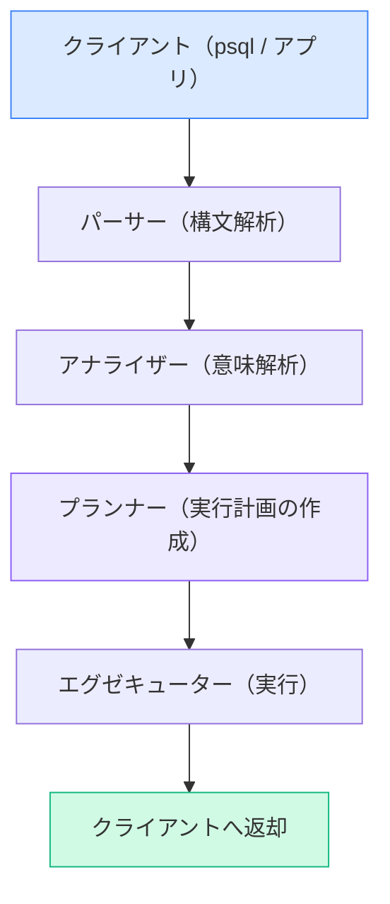

# 1. PostgreSQLとは？
PostgreSQLとは、1996年に正式リリースされたオープンソースのリレーショナルデータベース管理システム（RDBMS）です。

「Postgres」と略されることも多く、世界中の企業・個人開発者に広く使われています。

## 特徴
そんなPostgreSQLですが、以下のような特徴があります。

- オープンソースで完全無料
- ACID特性に準拠しており、データの整合性・信頼性が高い
- JSON型のサポートなど、RDBMSとしては珍しい柔軟なデータ型に対応
- 拡張性が高く、自作の関数・型・演算子を追加できる

## 使用例

| 用途                     | 具体例                           |
| ------------------------ | -------------------------------- |
| Web アプリのデータ永続化 | ユーザー情報・注文履歴の管理     |
| 業務システムの DB        | 在庫管理・会計システム           |
| ログ・分析基盤           | アクセスログの蓄積・集計         |
| 地理情報システム（GIS）  | PostGIS 拡張を使った位置情報管理 |
| JSON ドキュメントストア  | 半構造化データの保存・検索       |


# 2. RDBMSの基本概念
PostgreSQL を使う前に、RDBMS の基本的な考え方を押さえておきましょう。

## データの構造

```
データベース（Database）
  └── スキーマ（Schema）
        └── テーブル（Table）
              ├── カラム（Column）：列。データの項目定義
              └── レコード（Row）：行。実際のデータ 1 件
```

Excel に例えると、**テーブル＝シート、カラム＝列、レコード＝行**のイメージです。

## キーの概念

| 種類                    | 説明                                                       |
| ----------------------- | ---------------------------------------------------------- |
| 主キー（PRIMARY KEY）   | テーブル内でレコードを一意に識別する列。重複・NULL は不可  |
| 外部キー（FOREIGN KEY） | 別テーブルの主キーを参照する列。テーブル間の関係を定義する |
| ユニークキー（UNIQUE）  | 重複を許さないが、NULL は複数可                            |
| インデックス（INDEX）   | 検索を高速化するための索引。主キーには自動で作成される     |


# 3. PostgreSQLのアーキテクチャ

## 構成要素

| パーツ名               | 役割             | 何をしているか                                                         |
| ---------------------- | ---------------- | ---------------------------------------------------------------------- |
| postmaster             | メインプロセス   | クライアントからの接続を受け付け、子プロセスを管理する                 |
| バックエンドプロセス   | クエリ処理       | 接続ごとに生成され、SQL の解析・実行を担当する                         |
| 共有バッファ           | メモリキャッシュ | ディスク I/O を減らすため、頻繁にアクセスするデータをメモリに保持する  |
| WAL（Write-Ahead Log） | ログ             | データ変更前にログを書き出すことでクラッシュ時のデータ復旧を可能にする |
| バキューム（VACUUM）   | メンテナンス     | 削除・更新で不要になった領域を回収し、テーブルを健全に保つ             |

## クエリが実行されるまでの流れ



1. クライアントから SQL を受け取る
2. **パーサー** が構文解析し、構文ツリーを生成する
3. **アナライザー** がテーブル・カラムの存在確認などの意味解析を行う
4. **プランナー** が最も効率的な実行計画を選択する
5. **エグゼキューター** が実行計画に従ってデータを取得・加工し、結果を返す


# 4. 開発環境の構築
仕組みは理解できたと思うので、実際に開発を進めていくための準備について触れていきます。

## PostgreSQLのインストール
公式サイト（postgresql.org）からインストーラーをダウンロードするか、パッケージマネージャーで入れるのが一般的です。

```bash
# macOS（Homebrew）
brew install postgresql@16

# Ubuntu / Debian
sudo apt install postgresql
```

## 接続ツールの選択

| ツール名         | 特徴                                                         | 費用               |
| ---------------- | ------------------------------------------------------------ | ------------------ |
| **psql（推奨）** | PostgreSQL 公式の CLI ツール。軽量でサーバー上でも使いやすい | 無料               |
| pgAdmin          | 公式 GUI ツール。ブラウザベースで操作できる                  | 無料               |
| DBeaver          | 多くの DB に対応した汎用 GUI ツール                          | 無料（有償版あり） |
| TablePlus        | Mac / Windows 向けのスタイリッシュな GUI ツール              | 無料（有償版あり） |

:::note info
**psql は PostgreSQL をインストールすれば同梱されています！**
別途インストールする必要はありません。
:::

## データベース・テーブルの作成

```sql
-- データベースの作成
CREATE DATABASE mydb;

-- テーブルの作成
CREATE TABLE users (
    id         SERIAL PRIMARY KEY,
    name       VARCHAR(100) NOT NULL,
    email      VARCHAR(255) UNIQUE NOT NULL,
    created_at TIMESTAMP DEFAULT CURRENT_TIMESTAMP
);
```

## 拡張機能の追加（必要に応じて）
標準の機能だけでは足りないとき、拡張機能を追加することで機能を拡張できます。

```sql
-- 利用可能な拡張機能の一覧を見る
SELECT * FROM pg_available_extensions;

-- 拡張機能を追加する（例：全文検索の pg_trgm）
CREATE EXTENSION IF NOT EXISTS pg_trgm;

-- インストール済みの拡張機能を確認する
SELECT * FROM pg_extension;
```


# 5. PostgreSQLの型について
PostgreSQL もカラムを作るときに必ず型を宣言する必要があります。
適切な型の選択がデータ品質とパフォーマンスに直結します。

## 主な型一覧

| 分類   | 型名               | 説明                            | 使いどころ                         |
| ------ | ------------------ | ------------------------------- | ---------------------------------- |
| 整数   | `INTEGER`          | 32bit 整数                      | ID・個数・年齢                     |
| 整数   | `BIGINT`           | 64bit 整数                      | 大きな ID や件数                   |
| 小数   | `NUMERIC(p,s)`     | 精密な小数                      | 金額・税率（誤差が許されない場合） |
| 小数   | `DOUBLE PRECISION` | 浮動小数点                      | 座標・割合                         |
| 文字列 | `VARCHAR(n)`       | 可変長文字列（上限あり）        | 名前・メールアドレス               |
| 文字列 | `TEXT`             | 長さ制限なし文字列              | 本文・説明文                       |
| 真偽値 | `BOOLEAN`          | true / false                    | フラグ・条件の結果                 |
| 日時   | `TIMESTAMP`        | 日付＋時刻                      | 作成日時・更新日時                 |
| 日時   | `DATE`             | 日付のみ                        | 生年月日                           |
| JSON   | `JSONB`            | バイナリ形式の JSON（検索可能） | 柔軟な構造のデータ                 |
| 配列   | `INTEGER[]` など   | 配列型                          | タグ一覧など                       |

## NULLの扱い
PostgreSQL では `NULL` は「値が存在しない」を意味し、通常の比較演算子では扱えません。

```sql
-- ❌ これは NULL を検出できない
WHERE memo = NULL

-- ✅ IS NULL / IS NOT NULL を使う
WHERE memo IS NULL
WHERE memo IS NOT NULL
```


# 6. 基本的なSQL操作

## CRUD操作

```sql
-- Create：レコードの追加
INSERT INTO users (name, email)
VALUES ('山田太郎', 'yamada@example.com');

-- Read：レコードの取得
SELECT * FROM users WHERE id = 1;

-- Update：レコードの更新
UPDATE users SET name = '山田次郎' WHERE id = 1;

-- Delete：レコードの削除
DELETE FROM users WHERE id = 1;
```

## よく使う句

```sql
SELECT name, email
FROM users
WHERE created_at >= '2024-01-01'
ORDER BY created_at DESC
LIMIT 10
OFFSET 20;  -- 21 件目から取得（ページネーション）
```

## テーブルの結合（JOIN）

```sql
-- INNER JOIN：両方に一致するものだけ
SELECT orders.id, users.name
FROM orders
INNER JOIN users ON orders.user_id = users.id;

-- LEFT JOIN：左テーブルは全件、右は一致するものだけ
SELECT users.name, orders.id
FROM users
LEFT JOIN orders ON users.id = orders.user_id;
```


# まとめ

| 章                   | 学んだこと                                                       |
| -------------------- | ---------------------------------------------------------------- |
| 1. PostgreSQL とは   | オープンソースの RDBMS。信頼性・拡張性が高く幅広い用途で使われる |
| 2. RDBMS の基本概念  | DB・テーブル・カラム・レコードの構造と、キーの種類を理解する     |
| 3. アーキテクチャ    | クエリがどのように処理されるかの内部的な流れ                     |
| 4. 開発環境の構築    | インストール・接続ツール・基本的な DB・テーブル作成              |
| 5. 型について        | 適切な型の選択がデータ品質とパフォーマンスに直結する             |
| 6. 基本的な SQL 操作 | CRUD・絞り込み・JOIN など日常的に使うクエリ                      |
